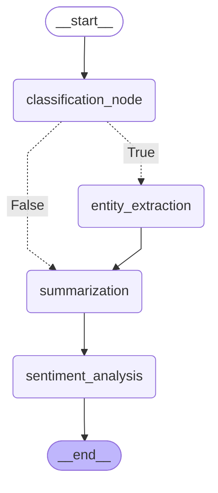

# Workflow Graph

```mermaid
---
config:
  flowchart:
    curve: linear
---
graph TD;
	__start__([<p>__start__</p>]):::first
	classification_node(classification_node)
	entity_extraction(entity_extraction)
	summarization(summarization)
	sentiment_analysis(sentiment_analysis)
	__end__([<p>__end__</p>]):::last
	__start__ --> classification_node;
	classification_node -. &nbsp;True&nbsp; .-> entity_extraction;
	classification_node -. &nbsp;False&nbsp; .-> summarization;
	entity_extraction --> summarization;
	summarization --> sentiment_analysis;
	sentiment_analysis --> __end__;
	classDef default fill:#f2f0ff,line-height:1.2
	classDef first fill-opacity:0
	classDef last fill:#bfb6fc

```
