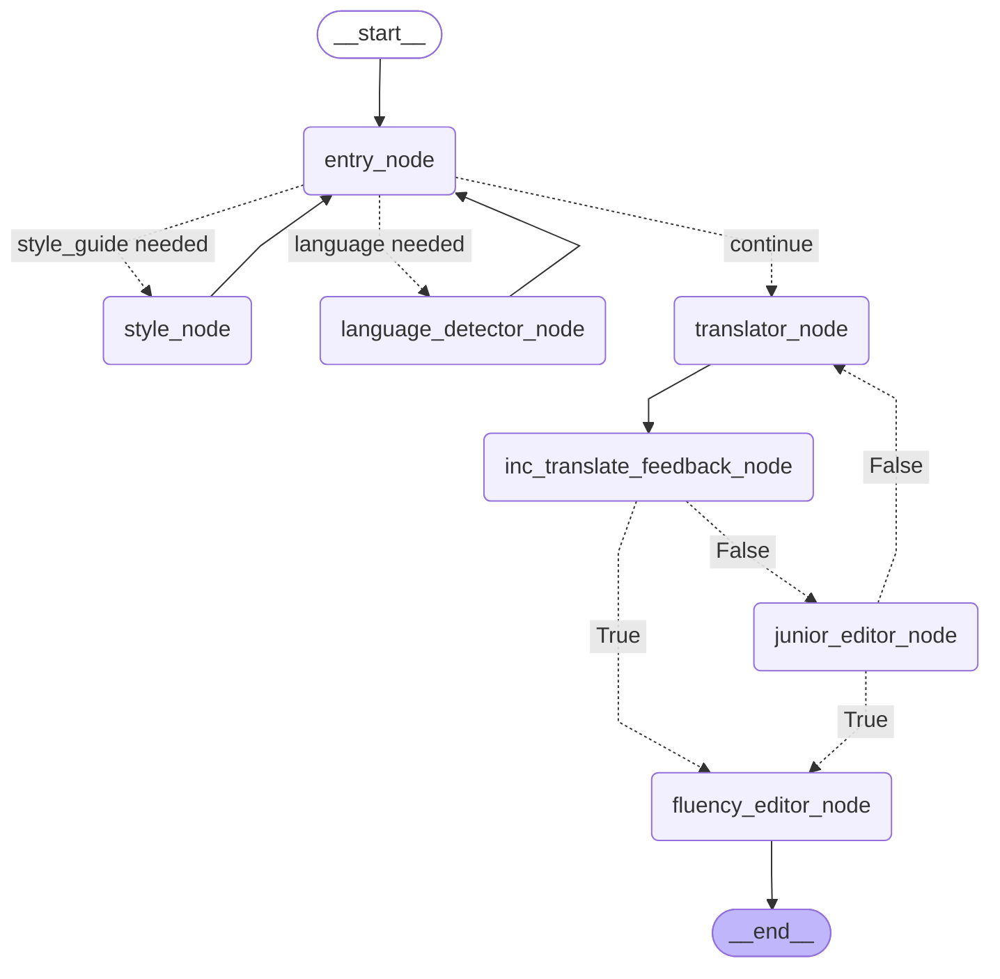

# Translation Workflow Graph

```mermaid
---
config:
  flowchart:
    curve: linear
---
graph TD;
	__start__([<p>__start__</p>]):::first
	entry_node(entry_node)
	style_node(style_node)
	language_detector_node(language_detector_node)
	translator_node(translator_node)
	junior_editor_node(junior_editor_node)
	inc_translate_feedback_node(inc_translate_feedback_node)
	fluency_editor_node(fluency_editor_node)
	__end__([<p>__end__</p>]):::last
	__start__ --> entry_node;
	entry_node -. &nbsp;language needed&nbsp; .-> language_detector_node;
	entry_node -. &nbsp;style_guide needed&nbsp; .-> style_node;
	entry_node -. &nbsp;continue&nbsp; .-> translator_node;
	inc_translate_feedback_node -. &nbsp;True&nbsp; .-> fluency_editor_node;
	inc_translate_feedback_node -. &nbsp;False&nbsp; .-> junior_editor_node;
	junior_editor_node -. &nbsp;True&nbsp; .-> fluency_editor_node;
	junior_editor_node -. &nbsp;False&nbsp; .-> translator_node;
	language_detector_node --> entry_node;
	style_node --> entry_node;
	translator_node --> inc_translate_feedback_node;
	fluency_editor_node --> __end__;
	classDef default fill:#f2f0ff,line-height:1.2
	classDef first fill-opacity:0
	classDef last fill:#bfb6fc

```
